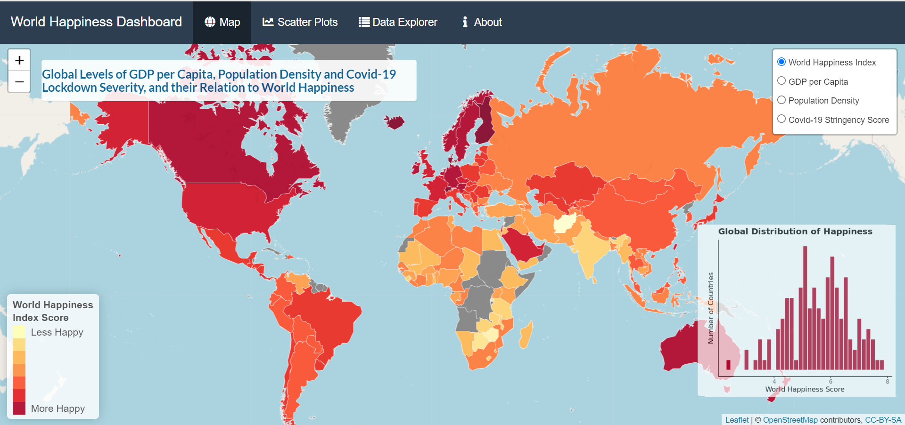

- [Project Overview](#project-overview-is-world-happiness-affected-by-gdp-per-capita-population-density-or-covid-lockdown-severity)
  - [Important steps before running the code](#important-steps-before-running-the-code)
  - [Repository Overview](#repository-overview)
  - [Project Conclusions](#project-conclusions)
  - [Project Limitations](#project-limitations)
  - [Future Directions](#future-directions)

# Project Overview: Is World Happiness Affected by GDP per Capita, Population Density or Covid-19 Lockdown Severity?
This project creates a shiny dashboard, programmed in R. It aimed to visualise global levels of happiness ratings, GDP per capita, population density per km squared and Covid-19 lockdown severity, using an interactive map. It then sought to combine these, by visualising scatter-plots for the relationship each of these demographic factors had with global happiness levels, as an overlay to the interactive map. To allow the reader to further explore these scatter-plots, full-size interactive graphs were provided. Finally, an interactive table was included for further customised exploration of the dataset.

This project was for a university assignment on data visualisation in R.

Link to the published dashboard can be found [here](https://c6gp2m-luke-jenner.shinyapps.io/PSY6422_Project/).

Link to the projects published R markdown can be found [here](https://rpubs.com/lukejenner6/892991).

The dashboard's interface can be seen in this screenshot:

## Important steps before running the code

**Ensure you manually install the fonts from the 'font_download' folder before running the scripts.**

### Working Directory
The working directory should be formatted to include the R scripts in the main folder, with the **graphs**, **data** and **www** subfolders saved here.
Ensure the **here()** function is set correctly to your working directory, by first restarting R and then setting the working directory to the source file location. 

## Repository Overview 
**data:** All data required for the dashboard.

**graphs:** This contains the generated graphs from the **app.R** script. When downloaded as a sub folder, the **app.R** script  will automaticallyy update this folder when run. 

**font_download:** This contains *'Source Sans Pro'* .ttf files to be installed onto the computer. These need to be **installed manually** before executing the code.

**www:** This contains the screenshots that are used in this README file and the project_overview file. It is named www inline with shiny app documentation.

**project_overview:** This is an R markdown file which contains the codebook and outlines the project's meta-data, goals, and coding process. 

**app.R:** R script for running the dashboard. This is split into three sections: importing and cleaning the data, creating graphs and variables for the dashboard, and executing the dashboard. It is best to view the dashboard in a browser window, as the aesthetics are tailored towards this.

## Project Conclusions
Although the reader is encouraged to freely interpret the data and draw their own conclusions, the author's own inferrences, from this data, are outlined below. The first conclusions were that western countries are happier, richer and more densely populated. However, Covid-19 lockdown severities seemed to differ drastically within continents, with South America seeming to have consistently stricter lockdown measures.

This project also concluded that GDP per capita may have a strong relationship with a country's happiness (where richer countries are happier), Covid-19 lockdown severity a moderate relationship (where stricter countries are happier) and population density has no relationship when the effects of outliers are reduced. However, no definitive conclusions can be made without further statistical analysis.

## Project Limitations
* The entry dates for the Covid-19 lockdown stingency scores (2020-2022) proceed World Happiness Index Scores (2021), so the true effects of Covid-19 lockdowns may be missed.
* There are many NA values for small or developing countries, so the data may be biased away from these countries.
* Population density was massively skewed by highly dense city states (Hong Kong and Singapore), so a log transformation was decided to reduce their influence. This was also conducted to the colour palette of the leaflet map, as to allow for a greater range of polygon colour, and thus better interpretation of true differences in population density. However, log transformations make it harder to convey exact relative differences in population density.

## Future Directions
The community is welcome to improve this code. Some suggestions are:
* This code could be modified to substitute NA values with prior years of records. Data point record years could then be recorded within the interactive data explorer.
* The green text highlights could be altered towards orange, as to be more consistent with the dashboard's style.
* Subtitles and captions could be added to the ggplotly graphs.
* An NA key could be added to the leaflet map legend.
* Statistical analysis could be conducted and write-up included to better infer the relationships between the variables.
* Code to programatically open and install the .ttf font files could be included.

