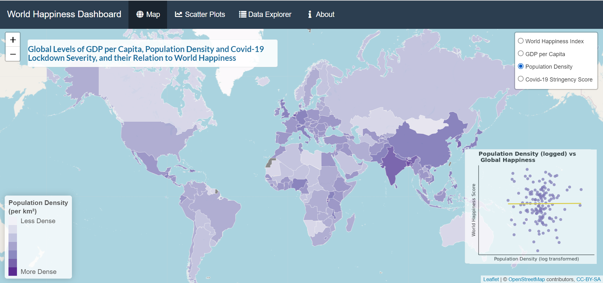
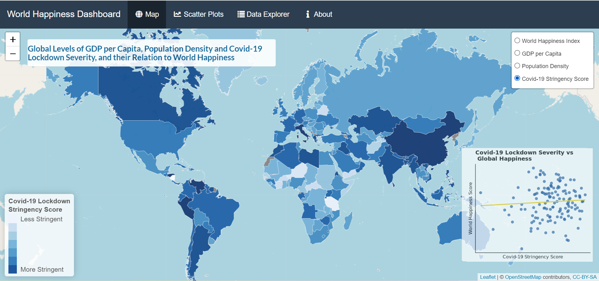

&nbsp;

# Overview
This document outlines the process and materials required to create the happiness dashboard. This report outlines code specific to the app.R file. 

The project’s github repository link can be found [here](https://github.com/lukejenner6/PSY6422_Project).

The shiny app link can be found [here](https://c6gp2m-luke-jenner.shinyapps.io/PSY6422_Project/).

**This dashboard aims to visualise the global levels of:**

* **World Happiness**
* **Population Density per km$^2$**
* **GDP per Capita**
* **Covid_19 Lockdown Stringency**

It also aims to explore the three demographic variables’ relationships with a country’s **World Happiness Index score**.

&nbsp;

### Content
This document will outline the data sources used, the project's code book, the project's limitations and conclusions, and explain and demonstrate the code. 

However, as shiny apps cannot be rendered in rmarkdown, for code sections discussing the UI and server, the dashboard's construction cannot be demonstrated. Therefore, these sections are intended to instead just explain the code. If the reader wishes to construct the app themselves, they are welcome to consult the [project's github repository](https://github.com/lukejenner6/PSY6422_Project), or view the dashboard [online](https://c6gp2m-luke-jenner.shinyapps.io/PSY6422_Project/).

&nbsp;

## Format 
The dashboard is a shiny app, structured as an *interactive map*, that shows global levels of each variable. It features interactive labels and layer specific histograms or scatter plots, to show the connection between each variable and world happiness. This map is created using the **leaflet package**, with the complimentary graphs plotted using **ggplot2**.

The shiny app also includes full scale interactive scatter plots, where the user can view which country each data point represents. These are created using **ggplotly**. Moreover, the data explorer, created using **DT**, features heading toggles and a search engine. Finally, the ‘about’ tab outlines the project and data used.

The dashboard is created with the intent to further the exploration of the data's story with each tab. The interactive map (key visualisation) is created with the intent to introduce the reader to an overview of the data. It clearly outlines key information from the data with the colour palette and scatter plots, whilst allowing exploration of individual countries' scores. The interactive scatter plots then further the data's story by letting the reader investigate which particular countries propel the relationship between each variable and global happiness. This also affords opportunity to compare the difference a log transformation has on the population density data. Finally, further personalised exploration is encouraged with the data explorer. Here, reader's can search for particular countries of their own interest or search for the highest or lowest scoring countries on particular variables.

The shiny app’s interface for the key visualisation can be seen below:


&nbsp;


&nbsp;



&nbsp;



&nbsp;


## Version Control
This project was written using **R script**, **version 4.1.2 (2021-11-01)**.

The following packages were used:

* **tidyverse** version 1.3.1
* **here** version 1.0.1
* **rvest** version 1.0.2
* **rgdal** version 1.5.29
* **leaflet** version 2.1.1
* **RColorBrewer** version 1.1.3
* **dplyr** version 1.0.8
* **ggplot2** version 3.3.5
* **plotly** version 4.10.0
* **readr** version 2.1.2
* **ggthemes** version 4.2.4
* **htmlwidgets** version 1.5.4
* **sysfonts** version 0.8.8
* **shiny** version 1.7.1
* **shinydashboard** version 0.7.2
* **htmltools** version 0.5.2
* **DT** version 0.22
* **shinythemes** version 1.2.0

&nbsp;

## Resources Used 

* [Dataslice, 2020:](https://www.youtube.com/watch?v=v8Yh_4oE-Fs) Youtube video guide on webscraping.

* [Yan Holtz, 2018:](https://r-graph-gallery.com/183-choropleth-map-with-leaflet.html) Informative guide for creating interactive choropleth maps with R and leaflet.

* [Wendy Wang, 2021:](https://medium.com/ibm-data-ai/layer-specific-legend-in-leaflet-8e80ffd72e03) Useful guide for creating layer-Specific legends in leaflet, using shiny.

* [Dataslice, 2020:](https://www.youtube.com/watch?v=rBp3eYHrsfo&list=PLZ1vfyM4ZtLg-0IBUe_91M0FX6ykLsvQy) Youtube video guide on plotly.

* [Shiny Gallery:](https://shiny.rstudio.com/gallery/) A great resource for inspecting others' shiny app code.

* [Xie et al., 2021:](https://bookdown.org/yihui/rmarkdown/) A comprehensive guide to rmarkdown.

* [Stack Overflow:](https://stackoverflow.com/) General queries and support

&nbsp;

&nbsp;

# Data


## World Happiness Index Score
The World Happiness Report is an annual report that inspects the state of global happiness in 156 countries. It is carried out by a collaboration between the UN and a number of universities and measures subjective ratings of happiness within a country.

Data is primarily used from the Gallup World Poll. Nationally representative samples of respondents are asked to think of a ladder, with the best possible life for them being a 10, and the worst possible life being a 0. They are then asked to rate their own current lives on that 0 to 10 scale. The report correlates the life evaluation results with various life factors. These life factor variables are: GDP, life expectancy, generosity, social support, freedom and corruption.

This project analysed data from the World Happiness Report 2021 ([link here](https://worldhappiness.report/ed/2021/)).

Data was web-scraped from the website countryeconomy.com ([link here](https://countryeconomy.com/demography/world-happiness-index)).

&nbsp;

## GDP per Capita
Gross domestic product (GDP) is a monetary measure of the market value of all the final goods and services produced in a specific time period by countries. GDP per capita shows a country’s GDP divided by its total population. It is therefore a measure of a country’s relative wealth. This project measured GDP in US$.

Data was sourced from the World Bank, for the year 2020 ([link here](https://data.worldbank.org/indicator/NY.GDP.PCAP.CD)).

&nbsp;

## Population Density
Population density is the concentration of individuals in a specific country. This project measured population density per km2 of land area.

Data was sourced from the World Bank, for the year 2020 ([link here](https://data.worldbank.org/indicator/EN.POP.DNST?view=chart)).

&nbsp;

## Covid-19 Stringency
The Oxford Covid-19 Government Response Tracker (OxCGRT) collects systematic information on policy measures that governments have taken to tackle Covid-19. It is published by the University of Oxford and Blavatnik School of Government. It is essentially a measure of the severity of a country’s Covid-19 lockdown measures.

The stringency index is a composite measure based on nine response indicators including school closures, workplace closures, and travel bans, rescaled to a value from 0 to 100 (100 = strictest). This project averaged the data records from 21st January 2020 till 20th March 2022, to define a country’s average Covid-19 response stringency during this time.

Data was sourced from the Covid-19 Government Response Tracker project, published by the University of Oxford and Blavatnik School of Government ([link here](https://www.bsg.ox.ac.uk/research/research-projects/covid-19-government-response-tracker)).

&nbsp;

&nbsp;

# Codebook
The table below outlines the variables that are used for the scatter plots and is also a transposed version of the shapefile data used to construct the leaflet maps, but omits the geospatial data. Specifically, it is the variables used in the scatter_df data frame.

Variable Title | Explanation |
|:------:|:------|
| ISO3 | A 3 letter country code |
| Country | Country name |
| happiness_score | A country’s 2021 World Happiness Index score |
| gdp | A country's GDP per capita (US\$) for 2020 |
| pop_density | A country's population density per km$^2$ for 2020 |
| avg_covid_score | Average Covid-19 lockdown stringency score from 21/03/2020 - 20/03/2022 |
| pop_density_log | Population density per km$^2$ - log transformed |
| commagdp | GDP per capita (US$) with a comma seperator and rounded to 2 decimal places for easy reading in labels |

&nbsp;

&nbsp;

# Conclusions, Limitations and Future Directions

&nbsp;

## Project Conclusions
Although the reader is encouraged to freely interpret the data and draw their own conclusions, the author’s own inferrences, from this data, are outlined below. The first conclusions were that western countries are happier, richer and more densely populated. However, Covid-19 lockdown severities seemed to differ drastically within continents, with South America seeming to have consistently stricter lockdown measures.

This project also concluded that GDP per capita may have a strong relationship with a country’s happiness (where richer countries are happier), Covid-19 lockdown severity a moderate relationship (where stricter countries are happier) and population density has no relationship when the effects of outliers are reduced. Interestingly, the relationship between GDP per capita and world happiness appears to level off at around  $50,000. However, no definitive conclusions can be made without further statistical analysis.

&nbsp;

## Limitations 
The main limitation is that the data analysed is from different years. However, this may be less of an issue for GDP per capita and population density as their publishing date (2020), preceded the outcome variable of world happiness (2021), meaning that some time may have elapsed to allow for effects of these to influence world happiness. However, the Covid-19 response scores’ time period (2020-2022) proceeded the World Happiness Index. From 2021-2022, there have been large fluctuations in global lockdowns and increasing disparity in country’s lockdown measures, as particular countries gain better access to vaccines. This could have had a large impact on world happiness, which this project fails to highlight. However, as this project was conducted, whilst the Covid-19 pandemic was still ongoing, it is hard to access these insights. Therefore, this project would benefit being updated in a few years time, once the Covid-19 pandemic has subsided.

Another issue is that the data contains manyy NA values for small, or poorly developed countries. This means the projects conclusions, especially that of the scatter plots, may be biased away from less economically developed countries. The World Bank’s solution to this was to impute the NAs with entries from the most recent year of record. This project decided to avoid this as to not mislead the reader with outdated information. However, the project could be updated to impute past dates, and then record their entry date in the data explorer.

Finally, population density was massively skewed by highly dense city states (Hong Kong and Singapore), so a log transformation was decided to reduce their influence. This was also conducted to the colour palette of the leaflet map, as to allow for a greater range of polygon colour, and thus better interpretation of true differences in population density. However, log transformations make it harder to convey exact relative differences in population density.

&nbsp;

## Future Directions
The community is welcome to improve this code. Some suggestions are:

* This code could be modified to substitute NA values with prior years of records. Data point record years could then be recorded within the interactive data explorer.
* The green text highlights could be altered towards orange, as to be more consistent with the dashboard’s style.
* Subtitles and captions could be added to the ggplotly graphs.
* An NA key could be added to the leaflet map legend.
* Statistical analysis could be conducted and write-up included to better infer the relationships between the variables.
* Code to programatically open and install the .ttf font files could be included.
* Data pipelines could be created to automatically update the dashboard every year, as new reports are released. Yearly changes in these variables could also be visualised with line graphs and/or interactive sliders on the leaflet map.

&nbsp;

&nbsp;

# Code Outline
This section will outline each step used to code the shiny dashboard. Firstly, it will discuss steps required before running the code. Secondly, the code used to import and clean the data. Then the code used to create the variables and graphs used in the shiny dashboard. Finally, it outlines the code used in the UI and server to execute the shiny dashboard.


&nbsp;

## Important Steps before Running the Code
* Ensure the fonts are **manually installed** from the **‘font_download’** folder before running the scripts.
* The working directory should be formatted to include the R scripts and styles.css file in the main folder, with a subfolder titled **‘graphs’** and the **‘data’** and **www** subfolders saved in the main folder also.
* Ensure the **here()** function is set correctly to your working directory, by first restarting R and then setting the working directory to the source file location.

&nbsp;

&nbsp;

## Importing and Cleaning
This section will outline the steps to import and clean the data frames for each unique variable, joining these data frames together, before joining that data frame to a shapefile.

&nbsp;

### Setting the Environment
These are the packages required for this section of the process:

```{r message=FALSE, warning=FALSE}
library(tidyverse) #used for general data manipulation
library(here) #used to set a relative working directory
library(rvest) #used for webscraping
library(rgdal) #read the shape file

here() #this sets the relative working directory to the current file location
```

&nbsp;

### World Happiness Index Score
This is the code used to web scrape the data from [countryeconomy.com](https://countryeconomy.com/demography/world-happiness-index), directly into R. The google chrome extension **‘selector gadget’** was used to identify the unique HTML tags for each table column that was to be scraped. This was then fed into the web scraper. This creates a unique vector for each column, which are combined into a data frame, and the orginal vectors removed.

```{r message=FALSE, warning=FALSE}
### world happiness index scores 2021 ###

## webscrape data
link <-  "https://countryeconomy.com/demography/world-happiness-index" #website url
page <-  read_html(link)

country <-  page %>% html_nodes("td:nth-child(1)") %>% html_text() #scrapes the country column

happiness_score <-  page %>% html_nodes(".numero+ .numero") %>% html_text() #scrapes the WHI score column

whi <-  data.frame(country, happiness_score, stringAsFactors = FALSE) #combines the scraped columns into a new dataframe

```

This is the initial table for World Happiness Index scores:
```{r echo=FALSE, message=FALSE, warning=FALSE}
head(whi)
```

This code cleans the WHI dataframe. It creates a new column called country_sub, where the [+] is removed from the country names, before removing the original country names column and renaming country_sub back to country. It also typecasts the happiness_score variable to be numeric.

```{r}
## clean dataframe
whi$country_sub <- str_sub(
  whi$country, 
  start = 1, end = -5
) #removes [+] symbol from country names

whi <- whi %>% 
  select(country_sub, happiness_score) %>% #removes stringASFactors and country columns
  rename(country = country_sub) #renames country_sub back to country

whi$happiness_score <- as.numeric(whi$happiness_score) #convert score from character to integer

```

This is the final table for World Happiness Index scores:
```{r echo=FALSE}
head(whi)
```

&nbsp;

### GDP and Population Density
Both GDP per capita and population density data were downloaded from the same organisation, thus had the same formating and required identical cleaning. Therefore, this section summarises this process in combination.

The data is read from files within the *‘data’* subfolder. The first 4 lines of the csvs are omitted as these contained irrelevant information on metadata.

```{r}
## GDP ##

#read gdp data
gdp <- read.csv(here('data', 'gdp_worldbank.csv'), 
                skip = 4, header = T) #removes first 4 irrelevant cells from file

## Population Density ##

#read population density
pop <- read.csv(here('data','worldbank_pop.csv'), 
                skip = 4, header = T) #removes first 4 irrelevant cells from file
```

The data frames were then cleaned to only include columns for the country name and respective records from the most recent year (2020). It could be argued this could be made into a function, but as it was only replicated once, it was deemed this would make the code unnecessarily complex.

```{r}
#remove uneeded variables
gdp <- gdp %>% 
  select(Country.Name, X2020, Country.Code) %>% #edit pop to only include country.name and 2020
  rename(country = Country.Name,
         gdp = X2020) #rename country name and 2020 column header

#remove uneeded dates
pop <- pop %>% 
  select(Country.Name, X2020, Country.Code) %>% #edit pop to only include country.name and 2020
  rename(country = Country.Name,
         pop_density = X2020) #rename country name and 2020 column header
```

This is the final data frame for GDP per capita:
```{r echo=FALSE}
head(gdp)
```

This is the final data frame for population density:
```{r echo=FALSE}
head(pop)
```

&nbsp;

### Covid-19 Stringency Score
This code shows data being read from the csv in the ‘data’ subfolder. This data gives daily records. To produce a single overall value that is denoted to each country, the data was first grouped by country code and then all entries were averaged. The column headers were then renamed.

```{r}
## Covid ##

#read covid stringency data

covid <- read.csv(here('data', 'covid-stringency-index.csv')) #reads data

#create new column to average the data and rename columns
covid <- covid %>% group_by(Code) %>% #groups the countries together
  summarise(avg_covid_score = mean(stringency_index)) %>% #finds average stingency index score across 
  rename(Country.Code = Code) #renames country column 
```

This is the data frame for Covid-19 stringency scores:
```{r echo=FALSE}
head(covid)
```

&nbsp;

### Joing the Data
To create the final data frame, the 4 initial data frames had to be joined.

Before this could occur the congruence of country names between whi and gdp had to be checked. To do this, these data frames were full joined and checked for NA values. These were inserted into a spreadsheet and then checked if missingness was due to disparity in the country names.

Once these incongruent countries had been identified, two cleaning functions were created. The first cleaning function (**which_country**), returned the row index for the country name that needed to be changed. This takes the target data frame and country name as arguments. The second function (**country_change**), then passed that row index (always denoted by ‘index’), the target data frame and updated country name as arguments, to change the country name to the updated version. Once all country names were updated and the same across data frames, the data was ready to be joined. The country index was always passed to country_change as a variable, to allow for scalability and accuracy.

```{r message=FALSE, warning=FALSE}
#### create cleaning functions #######

## Find country row index function ##
which_country <- function(df, name){ #this function inserts the df name and country name to return its row index in the df
  which(df$country == name, arr.ind=TRUE)
}

## change name function ##
country_change <- function(df, index, name) { #this inputs the df name, row index as found using the which_country function and the new name to update the value with
  df[index, 1] = name  #updates column one of index x with name
  return(df) #returns a new df with the updated value to be assigned back to the df
}


#Join data to check NA values
check <- left_join(whi, gdp, by= 'country') #left joins first dataframe to left

rm(check)

#some country names are incongruent so these will need to be changed in either df in order to match

#whi
#Ivory Coast
index <- which_country(whi, 'Ivory Coast')
whi <- country_change(whi, index, 'Cote d\'Ivoire')

#Myanmar
index <- which_country(whi, 'Burma - Myanmar')
whi <- country_change(whi, index, 'Myanmar')

#Swaziland
index <- which_country(whi, 'Swaziland')
whi <- country_change(whi, index, 'Eswatini')

#gdp and pop
#The Congo
index <- which_country(gdp, 'Congo, Rep.')
gdp <- country_change(gdp, index, 'Republic of the Congo')

#Egypt
index <- which_country(gdp, 'Egypt, Arab Rep.')
gdp <- country_change(gdp, index, 'Egypt')

#The Gambia
index <- which_country(gdp, 'Gambia, The')
gdp <- country_change(gdp, index, 'The Gambia')

#Hong Kong
index <- which_country(gdp, 'Hong Kong SAR, China')
gdp <- country_change(gdp, index, 'Hong Kong')

#Iran
index <- which_country(gdp, 'Iran, Islamic Rep.')
gdp <- country_change(gdp, index, 'Iran')

#Kyrgyzstan
index <- which_country(gdp, 'Kyrgyz Republic')
gdp <- country_change(gdp, index, 'Kyrgyzstan')

#South Korea
index <- which_country(gdp, 'Korea, Rep.')
gdp <- country_change(gdp, index, 'South Korea')

#Laos
index <- which_country(gdp, 'Lao PDR')
gdp <- country_change(gdp, index, 'Laos')

#Russia
index <- which_country(gdp, 'Russian Federation')
gdp <- country_change(gdp, index, 'Russia')

#Venezuela
index <- which_country(gdp, 'Venezuela, RB')
gdp <- country_change(gdp, index, 'Venezuela')

#Yemen
index <- which_country(gdp, 'Yemen, Rep.')
gdp <- country_change(gdp, index, 'Yemen')

#Slovakia
index <- which_country(gdp, 'Slovak Republic')
gdp <- country_change(gdp, index, 'Slovakia')

#palestine
index <- which_country(gdp, 'West Bank and Gaza')
gdp <- country_change(gdp, index, 'State of Palestine')

```

The data was then fully joined. To do this **whi** and **gdp** were full joined by *‘country’*. Then **pop** was full joined by *‘Country.Code’*. Finally, **covid** was full joined by *‘Country.Code’*. This created a data frame containg all 4 variables. A full join was selected as each leaflet map would require the maximal information possible for each variable, and a full join would retain all the information in each table.

During the joining process, a country code was added for Taiwan as this was not present in the gdp or pop data frames. Moreover, the *‘country’* columns for the country names were removed, as the shapefile would be joined using country codes and already contained country names.

```{r}
##### fully join the data #####

join1 <- full_join(whi, gdp, by= 'country') #left joins first dataframe to left

#Taiwan need country codes inserted to be joined to pop and covid data
index <- which_country(join1, 'Taiwan')
join1[index, 4] = 'TWN'

# full join all data by Country.Code
df <- full_join(join1, pop, by = 'Country.Code')
df <- full_join(df, covid, by = 'Country.Code')

df <- df %>% select(-c(country.y, country = country.x)) #rename columns
```

The fully joined df looks like so:
```{r echo=FALSE}
head(df)
```

For the shiny dashboard, a scatter plot for log transformed population density is plotted, therefore an additional column that logs population density was added. Furthermore, one of the leaflet labels adds a column separator to GDP for easier reading. Therefore, a column for this was also added where gdp was formatted to 2 decimal places, with a comma separator as a character data type.

```{r}
## add logged pop_density column ##

df$pop_density_log = df$pop_density #create duplicate column
df$pop_density_log = log(df$pop_density_log) #log entire column


## add thousands seperator and round to 2dp##
df$commagdp = df$gdp
df$commagdp <- format(round(as.numeric(df$commagdp), 2), nsmall = 1, big.mark = ",") #rounds gdp to 2 dp then adds a comma separator
```

&nbsp;

### Merging the Shapefile
A leaflet map requires a shapefile. This contains all the geospatial coordinates and borderlines to form the polygons of each country. By merging the data to a shapefile, leaflet will be able to recognise each country’s value for the variables and colour its corresponding polygon accordingly. This project uses the **World Borders Dataset** as its geospatial datatset ([link here](http://thematicmapping.org/downloads/world_borders.php)). The World Borders Dataset shapefile is saved in the ‘data’ subfolder in the repository, titled **world_shape_file**.

This code reads the **world_shape_file** using the rgdal library. It then uses the merge function to left join the shapefile to df; tidyverse joins are not compatible with shapefiles. These are joined by the country code and ISO3 columns (both of these variables contain ISO3 country codes). A left join was selected as to only retain information for countries present in the geospatial data frame’s map, especially as gdp and pop contained information for regions not deemed as individual countries, such as ‘Africa Western and Central’.

```{r}
###### merged data to a geospatial shape file ###########

# Read this shape file with the rgdal library. 
world_spdf <- readOGR( 
  dsn= paste0(here('data','world_shape_file')), 
  layer="TM_WORLD_BORDERS_SIMPL-0.3",
  verbose=FALSE
)

#Join DF to spatial data
#Must use merge function when joining a spatial and non spatial DF

#Full join to detect non-congruent names
worldCountries <- merge(world_spdf, df, by.x = "ISO3", by.y = "Country.Code", all.x = TRUE) #all = TRUE dictates a left join from world_spdf
```

&nbsp;

### Convert Shapefile back to a Data Frame
In order for the scatter plots to read the country information, the shapefile needs to be copied to a data frame. It could be argued to use the original df variable, however this contains irrelevant regions and would be mismatched with the information within the maps.

This code simply converts the **‘data’** data frame (which contains the merged geospatial and variable data) within the shapefile to its own data frame. It then also renames the *‘NAME’* column to *‘Country’*, so the ggplotly labels are more intuitive. This is the data frame outlined in the codebook.
```{r}
#### convert geospatial data to normal df so ggplot can read it ####

## create worldCountries df
scatterdf <- worldCountries@data %>%  
  select(c(ISO3, NAME, happiness_score, gdp, pop_density, avg_covid_score, pop_density_log, commagdp)) #omits geospatial data

scatterdf <- scatterdf %>%  rename(Country = NAME)
```

This is the final data frame:
```{r echo=FALSE}
head(scatterdf)
```

It contains these total missing values per column:
```{r}
### Create Table to show number of missing values per column ###
total_missing <- sum(is.na(scatterdf))
country_missing <- sum(is.na(scatterdf$country))
ISO3_missing <- sum(is.na(scatterdf$ISO3))
happiness_score_missing <- sum(is.na(scatterdf$happiness_score))
pop_density_missing <- sum(is.na(scatterdf$pop_density))
gdp_missing <- sum(is.na(scatterdf$gdp))
avg_covid_score_missing <- sum(is.na(scatterdf$avg_covid_score))

missing <-  data.frame(ISO3_missing, country_missing,  happiness_score_missing, pop_density_missing, gdp_missing, avg_covid_score_missing, total_missing) # this data frame shows number of NAs per variable

head(missing)
```

&nbsp;

&nbsp;

## Dashboard Graphs and Variables
The code to create a dashboard with a leaflet map is heavily interdependent and quite complex. Therefore, this section tries to simplify this by creating as many extraneous variables as possible, along with constructing the complimentary graphs beforehand.

&nbsp;

### Setting the environment
```{r message=FALSE, warning=FALSE}
#for map variables
library(leaflet) #create leaflet map
library(RColorBrewer) #create custom palette for map
library(dplyr) #for data manipulation

#for ggplotly
library(ggplot2) #creation of base ggplot graph
library(plotly) #ggplotly function
library(readr) #saves the ggplotly widget
library(ggthemes) #allows for custom ggplot themes
library(htmlwidgets) #saves ggplotly to html
library(sysfonts) #downloads google font to R from computer
```

Import the google font from the computer’s hardrive. This should have been installed from the font_download folder.
```{r}
# import google font from computer. Ensure all ttf fonts are downloaded from the font_download folder first.
font_add_google("Source Sans Pro")
```

&nbsp;

### Leaflet Map Variables
This code outlines the creation of aesthetic variables for the leaflet map. **mytext** dictates the label text, **label** dictates the label’s font style and size, and **highlight** dictates how the polygon line width changes when a country is hovered over.

Each mypalette… (e.g. mypalettewhi) dictates the colour scale used to fill the polygons for that variable. Each color scale is taken from the rbrewer package. Colorbin instructs R to create a choropleth graph, and 9 bins are selected as to create the widest range of discrepancy possible between each value, thus allowing for greater information (rbrewer palettes max out at 9 bins). A choropleth graph was selected as this allows for the legend customisation within leaflet.

Gdp has a custom highlight variable, as this map outlines its polygons in black for greater contrast to the creamy-yellows, so needs black highlights.

```{r message=FALSE, warning=FALSE}
#### map variables #########

### general aesthetics ####

### label information ###
mytext <- paste(
  "Country: ", worldCountries@data$NAME,"<br/>", #label key and data
  "Happiness Score: ", round(worldCountries@data$happiness_score, 2), "<br/>", #data rounded to 2 dp
  "GDP per Capita: $", worldCountries@data$commagdp, "<br/>",
  "Population Density: ", round(worldCountries@data$pop_density, 2), "<br/>",
  "Covid Stringency: ", round(worldCountries@data$avg_covid_score, 2), "<br/>",
  sep=""
) %>%
  lapply(htmltools::HTML)


### label design ###
label <- labelOptions( 
  style = list("font-weight" = "normal", padding = "3px 8px"), 
  textsize = "13px", 
  direction = "auto"
) 

### Highlight Options ###
highlight <- highlightOptions(
  weight = 2, #line width
  color = "white",
  fillOpacity = 1.0,
  opacity = 1.0,
  bringToFront = TRUE)

#### Create Variables for WHI ###########

#custom colour palette
mypalettewhi <- colorBin( palette="YlOrRd", domain = worldCountries@data$happiness_score, bins = 20) #colorBin indicates that the palette will be placed into bins

#### Create Variables for gdp #########

#custom colour palette
mypalettegdp <- colorBin( palette="YlGn", domain=worldCountries@data$gdp, bins = 20)

#custom highlight options as gdp has white lines instead of black
highlightgdp <- highlightOptions(
  weight = 2,
  color = "black",
  fillOpacity = 1.0,
  opacity = 1.0,
  bringToFront = TRUE)


### Create Variables for Population Density #######

#custom colour palette
mypalettepop <- colorBin( palette="Purples", domain=worldCountries@data$pop_density_log, bins = 20)

### Create Variables for covid ################

#Custom colour palette
mypalettecovid <- colorBin(palette="Blues", domain = worldCountries@data$avg_covid_score, bins = 20)
```

&nbsp;

### Creating the Data Explorer Data Frame
As to not over saturate and confuse the reader with unnecessary information, the data frame, for the data explorer, was constructed to only include columns for each variable. NAME and ISO3 were also included for context and easy searching. The column headers were renamed to longer, more intuitive titles.
```{r message=FALSE, warning=FALSE}
#### dataframe for data explorer #################################

#select only relevant columns
cleantable <- worldCountries@data %>% 
  select(c(NAME, ISO3, happiness_score, gdp, pop_density, avg_covid_score))

#rename columns to intuitive names
cleantable <- cleantable %>% rename(country = NAME,
                                    population_density = pop_density,
                                    covid_score = avg_covid_score)
```

&nbsp;

### Ggplotly Graphs
This section outlines the creation of the interactive ggplotly graphs.

This code outlines the creation of the font size and colour with **font**, which is then passed to **labelplot** to select the label’s box colour.
```{r message=FALSE, warning=FALSE}
### Create global variables for pop up label settings ###

## label font
font = list(
  size = 15,
  color = "white"
)

## label size and color
labelplot = list(
  bgcolor = "#232F34",
  bordercolor = "transparent",
  font = font
)
```

This code outlines the creation of each ggplotly graph. An initial ggplot scatter plot, with a linear best fit line is constructed. The scatter plot's point colours match the Rcolorbrewer palette of the leaflet map, to create a recognisable link between the visuals. 

Labels are then added, with the custom theme ’gdocs’ and the Google font ‘Source Sans Pro’ set. This styles the plot to have the professional layout of google charts, and to fit within the dashboard's overall theming. 

This ggplot is then passed through **ggplotly** to convert the ggplot to an interactive plotly graph. The ggplotly is then set to include the label settings and disable other ggplotly features, as to not over complicate the interactivity. The ggplotly graph is then saved to the ‘graphs’ sub folder. Unfortunately, ggplotly ignores the subtitles and captions of a ggplot.

```{r message=FALSE, warning=FALSE}
####### create ggplotly graphs ##################################

#### GDP ############################################

### ggplot ###

#create base graph
scatter_gdp <- ggplot(scatterdf, aes(x = gdp, y = happiness_score, label = Country)) + #adding text removes geom_smooth
  geom_point(colour = '#005a32', alpha = 0.7, size = 2.5) +
  geom_smooth(method = 'lm', se = FALSE, colour = 'gold2', alpha = 0.6, size = 1)

#add labels
scatter_gdp <- scatter_gdp +
  labs(title = "Relationship Between a Country's GDP per Capita and Happiness", 
       x = "Gross Domestic Product per Capita (US$)",
       y = "World Happiness Index Score") 

#add theme
scatter_gdp <- scatter_gdp + 
  theme_gdocs() + #custom theme from ggtheme
  theme(
    text = element_text(family = "Source Sans Pro"),
    plot.title = element_text(size = 16, face = 'bold'),
    plot.subtitle = element_text(size = 14),
    axis.title.x = element_text(size = 12),
    axis.title.y = element_text(size = 12))


## create ggplotly ##
graph_gdp.interactive = ggplotly(scatter_gdp, tooltip = 'Country')%>%
  style(hoverlabel = labelplot) %>%
  layout(
    font = font,
    xaxis = list(fixedrange = TRUE), #disables ability to scroll around plot
    yaxis = list(fixedrange = TRUE,
                 title = list(x= 0, xanchor = 'left', xref = 'container'))) %>% #edits title position
  config(displayModeBar = FALSE, showTips = FALSE) #disables fetures bar


#save graph
saveWidget(graph_gdp.interactive, here('graphs', "gdp_interactive.html"))


#### Population Density ############################################

## ggplot ##

#create base graph
scatter_pop <- ggplot(scatterdf, aes(x = pop_density, y = happiness_score, label = Country)) +
  geom_point(colour = '#6a51a3', alpha = 0.7, size = 2.5) +
  geom_smooth(method = 'lm', se = FALSE, colour = 'gold2', alpha = 0.6, size = 1)

#add labels
scatter_pop <- scatter_pop +
  labs(title = "Relationship Between a Country\'s Population Density and Happiness",
       x = "Population Density (km\u00B2)",
       y = "World Happiness Index Score")

scatter_pop <- scatter_pop + 
  theme_gdocs() + #custom theme
  theme(
    text = element_text(family = "Source Sans Pro"),
    plot.title = element_text(size = 16, face = 'bold'),
    plot.subtitle = element_text(size = 14),
    axis.title.x = element_text(size = 12),
    axis.title.y = element_text(size = 12))

## create ggplotly ##
graph_pop.interactive = ggplotly(scatter_pop, tooltip = 'Country')%>%
  style(hoverlabel = labelplot) %>%
  layout(font = font, 
         xaxis = list(fixedrange = TRUE), 
         yaxis = list(fixedrange = TRUE)) %>%
  config(displayModeBar = FALSE, showTips = FALSE)


#save graph
saveWidget(graph_pop.interactive, here('graphs', "pop_interactive.html"))

#### Population Logged #########################################################

### ggplot ###

#create base graph
scatter_poplog <- ggplot(scatterdf, aes(x = pop_density_log, y = happiness_score, label = Country)) +
  geom_point(colour = '#6a51a3', alpha = 0.7, size = 2.5) +
  geom_smooth(method = 'lm', se = FALSE, colour = 'gold2', alpha = 0.6, size = 1)

#add labels
scatter_poplog <- scatter_poplog +
  labs(title = "Relationship Between a Country\'s Population Density and Happiness \n Adjusted for Outliers (Log Transformed)",
       x = "Logged Population Density (km\u00B2)",
       y = "World Happiness Index Score") 

#add theme
scatter_poplog <- scatter_poplog + 
  theme_gdocs() + 
  theme(
    text = element_text(family = "Source Sans Pro"),
    plot.title = element_text(size = 16, face = 'bold'),
    plot.subtitle = element_text(size = 14),
    axis.title.x = element_text(size = 12),
    axis.title.y = element_text(size = 12))

## create ggplotly ##
graph_poplog.interactive = ggplotly(scatter_poplog, tooltip = 'Country')%>%
  style(hoverlabel = labelplot) %>%
  layout(font = font, 
         xaxis = list(fixedrange = TRUE), 
         yaxis = list(fixedrange = TRUE)) %>%
  config(displayModeBar = FALSE, showTips = FALSE)

#save graph
saveWidget(graph_poplog.interactive, here('graphs', "poplog_interactive.html"))

#### Covid #########################################

#create base graph
scatter_covid <- ggplot(scatterdf, aes(x = avg_covid_score, y = happiness_score, label = Country)) + #adding text removes geom_smooth
  geom_point(colour = '#084594', alpha = 0.7, size = 2.5) +
  geom_smooth(method = 'lm', se = FALSE, colour = 'gold2', alpha = 0.6, size = 1)

#add labels
scatter_covid <- scatter_covid +
  labs(title = "Relationship Between a Country's Covid-19 Lockdown Severity and Happiness", 
       x = "Covid-19 Stringency Index Score \n (Higher scores Indicate more Extreme Measures)",
       y = "World Happiness Index Score") 

#add theme
scatter_covid <- scatter_covid + 
  theme_gdocs() + 
  theme(
    text = element_text(family = "Source Sans Pro"),
    plot.title = element_text(size = 16, face = 'bold'),
    plot.subtitle = element_text(size = 14),
    axis.title.x = element_text(size = 12),
    axis.title.y = element_text(size = 12))

#create ggplotly
graph_covid.interactive = ggplotly(scatter_covid, tooltip = 'Country')%>%
  style(hoverlabel = labelplot) %>%
  layout(font = font, 
         xaxis = list(fixedrange = TRUE), 
         yaxis = list(fixedrange = TRUE)) %>%
  config(displayModeBar = FALSE, showTips = FALSE)

#save graph
saveWidget(graph_covid.interactive, here('graphs', "covid_interactive.html"))
```

&nbsp;

**These are the final ggplotly graphs.**

GDP per Capita:
```{r echo=FALSE, message=FALSE, warning=FALSE}
graph_gdp.interactive
```
Population Density:
```{r echo=FALSE, message=FALSE, warning=FALSE}
graph_pop.interactive
```

Population Density (log transformed):
```{r echo=FALSE, message=FALSE, warning=FALSE}
graph_poplog.interactive
```

Covid-19 Lockdown Stringency Score:
```{r echo=FALSE, message=FALSE, warning=FALSE}
graph_covid.interactive
```

&nbsp;

### Supporting Leaflet Graphs
This section outlines the creation of the supporting graphs found on the bottom right of the leaflet maps. These are created using ggplot. In order to keep the graphs as simple as possible (due to being smaller and complimentary to the leaflet map), theme_classic was used and all the axis labels and ticks were removed.

The first graph is a histogram of World Happiness Index scores and the subsequent graphs are all static, simpler versions of the ggplotly graphs.

To be more informative population density log transformed was selected, as population density’s complimentary graph.

```{r message=FALSE, warning=FALSE}
####### map graphs ##########################################

#### WHI Histogram ####
whi_map <- ggplot(scatterdf, aes(x = happiness_score)) + 
  geom_histogram(colour = 'white', fill = '#b10026', bins = 35) +
  theme_classic() +
  theme(
    axis.text.y=element_blank(),  #remove y axis labels
    axis.ticks.y=element_blank(),  #remove y axis ticks
    text = element_text(family = "Source Sans Pro"),
    plot.title = element_text(face = 'bold')
  ) + 
  labs(title = "Global Distribution of Happiness", 
       x = "World Happiness Score",
       y = "Number of Countries") 

#save graph
ggsave(here('graphs', 'happiness_hist.png'), plot = whi_map, height = 15, width = 26, units = 'cm')

###### gdp scatter ######
gdp_map <- ggplot(scatterdf, aes(x = gdp, y = happiness_score)) + 
  geom_point(colour = '#005a32', alpha = 0.7, size = 2.5) +
  geom_smooth(method = 'lm', se = FALSE, colour = 'gold2', alpha = 0.6, size = 1) +
  theme_classic() +
  theme(
    axis.text.x=element_blank(), #remove x axis labels
    axis.ticks.x=element_blank(), #remove x axis ticks
    axis.text.y=element_blank(),  #remove y axis labels
    axis.ticks.y=element_blank(),  #remove y axis ticks
    text = element_text(family = "Source Sans Pro"),
    plot.title = element_text(face = 'bold')
  ) + 
  labs(title = "GDP per Capita vs Global Happiness", 
       x = "GDP per Capita (US$)",
       y = "World Happiness Score") 

#save graph
ggsave(here('graphs', 'gdp_vs_happiness.png'), plot = gdp_map, height = 15, width = 26, units = 'cm')

##### pop density scatter ####
pop_map <- ggplot(scatterdf, aes(x = pop_density_log, y = happiness_score, label = Country)) +
  geom_point(colour = '#6a51a3', alpha = 0.7, size = 2.5) +
  geom_smooth(method = 'lm', se = FALSE, colour = 'gold2', alpha = 0.6, size = 1) +
  theme_classic() +
  theme(
    axis.text.x=element_blank(), #remove x axis labels
    axis.ticks.x=element_blank(), #remove x axis ticks
    axis.text.y=element_blank(),  #remove y axis labels
    axis.ticks.y=element_blank(),  #remove y axis ticks
    text = element_text(family = "Source Sans Pro"),
    plot.title = element_text(face = 'bold')
  ) + 
  labs(title = "Population Density (logged) vs\n Global Happiness", 
       x = "Population Density (log transformed)",
       y = "World Happiness Score") 

ggsave(here('graphs', 'population_vs_happiness.png'), plot = pop_map, height = 15, width = 26, units = 'cm')

##### covid scatter ####
covid_map <- ggplot(scatterdf, aes(x = avg_covid_score, y = happiness_score, label = Country)) + #adding text removes geom_smooth
  geom_point(colour = '#084594', alpha = 0.7, size = 2.5) +
  geom_smooth(method = 'lm', se = FALSE, colour = 'gold2', alpha = 0.6, size = 1) +
  theme_classic() +
  theme(
    axis.text.x=element_blank(), #remove x axis labels
    axis.ticks.x=element_blank(), #remove x axis ticks
    axis.text.y=element_blank(),  #remove y axis labels
    axis.ticks.y=element_blank(),  #remove y axis ticks
    text = element_text(family = "Source Sans Pro"),
    plot.title = element_text(face = 'bold')
  ) + 
  labs(title = "Covid-19 Lockdown Severity vs\n Global Happiness", 
       x = "Covid-19 Stringency Score",
       y = "World Happiness Score")

#save graph
ggsave(here('graphs', 'covid_severity_vs_happiness.png'), plot = covid_map, height = 15, width = 26, units = 'cm')

```

&nbsp;

**These are the final graphs:**

World Happiness Histogram:
```{r echo=FALSE, message=FALSE, warning=FALSE}
whi_map
```

GDP per Capita Scatter plot:
```{r echo=FALSE, message=FALSE, warning=FALSE}
gdp_map
```

Population Density Scatter plot:
```{r echo=FALSE, message=FALSE, warning=FALSE}
pop_map
```

Covid-19 Lockdown Severity Scatter plot:
```{r echo=FALSE, message=FALSE, warning=FALSE}
covid_map
```


&nbsp;

&nbsp;

## Dashboard Code
This section outlines the code to create the dashboard interface. It contains code for both the UI and server of the dashboard. The UI dictates the structure and format of the app. The server dictates the rendering of the fluid elements. Fluid elements are inserted into the UI’s format, and these are updated by the server whenever the user interacts with these elements.

Rmarkdown documents cannot run shiny apps. Therefore, the purpose of this document is to explain the motivation behind and purpose of the code, as opposed to demonstrating the app. For ease of explanation, the code for both the UI and server are broken into chunks. Though, to properly construct the app, this code would need to be run in unison. If the reader intends to run the app, the code for this can be found within the [project's github repository.](https://github.com/lukejenner6/PSY6422_Project)

&nbsp;

### Setting the Environment
```{r message=FALSE, warning=FALSE}
library(shiny) #creates shiny app
library(leaflet) #creates leaflet map
library(RColorBrewer) #allows for custom pallettes
library(dplyr) #data manipulation
library(shinydashboard) #create shiny dashboard
library(htmltools) #for creating html
library(DT) #add data table to dashboard
library(shinythemes) #adds premade themes
library(plotly) #render plotly
```

&nbsp;

### UI
The UI is used to construct 4 panels. Each panel’s code is quite complex, so will be broken down by panel.

&nbsp;

#### Introducing CSS
CSS is a style sheet language that uses HTML to describe the presentation of a document. It is particularly used to style and format web applications. Shiny can read CSS files to acquire the formatting logic that particular document provides. This allows for more advanced formatting, better tailored towards viewing on a web browser.

The CSS file used in this shiny application was named *'styles.css'*. It was modified from the CSS used in [Edward Parker's Covid Tracker](https://shiny.rstudio.com/gallery/covid19-tracker.html), that can be viewed on shiny gallery. *'styles.css'* contained the following code:

```{r eval=FALSE}
input[type="number"] {
  max-width: 80%;
}

div.outer {
  position: fixed;
  top: 56px;
  left: 0;
  right: 0;
  bottom: 0;
  overflow: hidden;
  padding: 0;
}

#controls {
  /* Appearance */
  background-color: white;
  padding: 0 10px 10px 10px;
  cursor: move;
  /* Fade out while not hovering */
  opacity: 0.65;
  zoom: 0.9;
  transition: opacity 10ms 10ms;
}

#controls:hover {
  /* Fade in while hovering */
  opacity: 0.9;
  transition-delay: 0;
}

#title {
  /* Appearance */
  background-color: white;
  cursor: move;
  /* Fade out while not hovering */
  opacity: 0.9;
  zoom: 0.9;
  transition: opacity 10ms 10ms;
}

#title:hover {
  /* Fade in while hovering */
  opacity: 0.95;
  transition-delay: 0;
}
```

This CSS contains particular customisation options for two of the leaflet map's hovering elements, the visualisation's title (denoted as title) and the scatter plot tab (denoted as controls). Each customisation particularly targets the elements opacity when the cursor is hovered over them or not. The title naturally has much higher opacity than the scatter plots. Quick transition times were given for instant feedback to the user. 

Furthermore, by incorporating a CSS file, HTML syntax can be used, such as '100%', to scale the map and scatter plots to completely fill the reader's browser window.

&nbsp;

#### UI settings
This code outlines the creation of the UI. The shiny theme flatly is set to dictate the colour and style of the tabs, collapsible allows the apps navbar to collapse when viewing on a phone. The HTML styles the navbar’s text font and colour. Window title sets the dashboard’s header.

```{r eval=FALSE}
ui <- navbarPage(theme = shinytheme('flatly'), collapsible = TRUE,
                 
                 
                 HTML('<a style="text-decoration:none;cursor:default;color:#FFFFFF;" class="active" href="#">World Happiness Dashboard</a>'), id="nav",
                 
                 windowTitle = "World Happiness Dashboard",
```

&nbsp;

#### Panel 1: Map
This code outlines the leaflet map panel. The icon dictates the navbar symbol, and the leaflet output dictates the tag for the fluid element to be rendered.

**Tags$head()** instructs shiny to read the *'styles.css* file. The leaflet output can then be set to '100%' in both height and width, as to fill the browser window.

The absolute panels are overlayed on top of the leaflet map. The first absolute panel creates the graph overlay. It is positioned relative to the web browser corners, and its height and width are also set. Fixed = TRUE means the panel moves as th browser is scrolled, and draggable = TRUE means the user can drag the panel around the browser. The plotoutput dictates the fluid element tag to be rendered.

The second absolute panel is for the title and this holds similar settings, but the text is directly written in the code as a h4 header size, with **style** colouring the text in navy blue.

As this tab is now paired to *'styles.css'*, the customisation settings are linked to elements by their **id**.

```{r eval=FALSE}
## First tab content. Inserts map within box ##################
                 tabPanel("Map", icon = icon("globe"),
                          div(class="outer",
                              tags$head(includeCSS("styles.css")), #adds css file
                          leafletOutput("map", #output is leaflet map
                                        height="100%", width = "100%"), #uses html syntax to fill browser window
                          
                          ### adds tab panel to map ###
                          
                          ## settings of tab panel for graphs
                          absolutePanel(
                            id = "controls", class = "panel panel-default", #id links to the CSS
                            bottom = 26, right = 26, fixed=FALSE, #sets default position
                            width = 300, height = 270, #sets size
                            draggable = TRUE,  #allows to be draggable
                            ## fills tab panel with plot             
                            plotOutput("scatterplot", height = 270, width = 300)
                          ),
                 
                 # tab panel for title
                 absolutePanel(id = "title", class = "panel panel-default", #id links to the CSS
                               top = 92, left = 65, width = 590, fixed=TRUE,
                               draggable = FALSE, height = "auto",
                               
                               (h4(strong("Global Levels of GDP per Capita, Population Density and Covid-19 Lockdown Severity, and their Relation to World Happiness"))), style="color:#045a8d"),
)
),
                 
```

&nbsp;

#### Panel 2: Scatter Plots
This code outlines the creation of the tab box for each of the ggplotly scatter plots. The tab box is held within a fluid row (this fixes the output to columns and rows). The first tab panel includes a text definition, to introduces the reader to the scatterplots. It is written in h3 headings to structure text size and paragraphs.

The subsequent panels render the ggplotly reactive elements as noted by their tags, and this code also dictates the panel headings.

```{r eval=FALSE}
## second tab content. Creates scatter plots ###################
                 tabPanel("Scatter Plots", icon = icon("chart-line"), #tab group name
                          fluidRow(
                            ## uses a tab box as multiple subtabs within the box ##
                            tabBox( 
                              width = 12, height = 500, #tab box size
                              id="tabchart1",
                              
                              ## tab panel one uses headings to create text 
                              tabPanel("Overview", 
                                       #overview heading
                                       HTML('<h1 style = "color:orange">Overview</h1>'), 
                                       
                                       h3('These scatter plots show each of the three variables\' relationships with a country\'s world happiness index score.'), 
                                       
                                       h3('Navigate each variable using the corresponding tab and hover over datapoints to reveal the country it represents.'), 
                                       
                                       h3('An alternative scatter plot for population density is provided, to show the relationship if the effects of outliers (Hong Kong and Singapore) are minimised. This was achieved by performing a log transformation on population density.')),
                              
                              #subsequent panels display plotly graphs as created previously
                              tabPanel("GDP per Capita", plotlyOutput("plot_gdp", height = 450)),
                              tabPanel("Population Density", plotlyOutput("plot_pop", height = 450)),
                              tabPanel("Population Density (Adjusted)", plotlyOutput("plot_pop_adj", height = 450)),
                              tabPanel("Covid-19 Stringency", plotlyOutput("plot_covid", height = 450))
                            )
                          )
                 ),
```

&nbsp;

#### Panel 3: Data Explorer
This tab is for the data explorer. The HTML and h4 outlines the colour and text size of the title and subtitle. The dataTableOutput is also a rendered element. Status colours the corners of the fluid page.

```{r eval=FALSE}
## third tab content. Creates a table ######################
                 tabPanel('Data Explorer', icon = icon("list", lib = "glyphicon"),
                          fluidPage(
                            HTML('<h1 style = "color:orange">Data Explorer</h1>'), #main title in orange
                            h4('Click on column headings to toggle the lowest or highest values for each variable. Use the search tool to explore particular countries.'), #subtitle created using heading
                            box(
                              width = NULL, height = 510, #width = null to fill out the page
                              status='primary', #highlights in blue
                              dataTableOutput("maptable") #maptable is output
                            )
                          )
                 ),
```

&nbsp;

#### Panel 4: About
This panel is text explaining the data and project goals. HTML is used when customising the text colour and background highlights of headings. The main body of text is written using h4 headings to create paragraphs. Images and URL links are also included (target = “_blank” opens the url in a new window). Page breaks also format the spacing between paragraphs.

```{r eval=FALSE}
## Final Tab Content. Textbox for overview ############
                 tabPanel('About', icon = icon("info"),
                          
                          fluidPage(width = 60, #tab is an open page document
                                    
                                    #HTML functionality to display text and change colour and format the page    
                                    HTML('<center><h1 style = "background-color:orange; color:white">Dashboard Information</h1></center>'),
                                    
                                    #adds smiling world image
                                    img(src="https://i.guim.co.uk/img/media/16ff6eca7df464c60bfa1d87f1388b80249c8ae2/0_775_3753_2252/master/3753.jpg?width=940&quality=45&auto=format&fit=max&dpr=2&s=d1d049bd2716c11ecb029329290c766b", 
                                        height="50%", width="50%", #reduces image size
                                        align = 'right'), #positions image to right
                                    
                                    #heading functions used to write content
                                    h4("This dashboard uses a map to visualise global levels of happiness, GDP per capita, population density and covid-19 response stringencies. The map features supporting graphs to visualise each variable\'s relationship with global happiness."),
                                    
                                    h4("Moreover, full scale interactive scatter plots are provided, to further invetsigate the relationships a country\'s GDP per capita, population density and Covid-19 response measures have with its happiness."),
                                    
                                    h4("Finally, a data explorer is provided for investigation of particular countries or searching of countries with extreme scores on these factors."),
                                    
                                    h4("Each visualisation is interactive, so the reader is encouraged to freely explore them."),
                                    
                                    br(), br(), br(), br(), br(), #br() indicates breaks. E.g. two breaks creates larger space
                                    
                                    ## Variables heading ##
                                    HTML('<center><h2 style = "background-color:orange; color:white">Variables</h2></center>'),
                                    
                                    br(),
                                    
                                    #WHI
                                    HTML('<h3 style = "color:orange">World Happiness Index Report</h2>'),
                                    h4("The World Happiness Report is an annual report that inspects the state of global happiness in 156 countries. It is carried out by the United Nations in collaboration with a group of universities, and measures subjective ratings of happiness within a country."),
                                    
                                    h4("Data is primarily used from the Gallup World Poll. Nationally representative samples of respondents are asked to think of a ladder, with the best possible life for them being a 10, and the worst possible life being a 0. They are then asked to rate their own current lives on that 0 to 10 scale. The report correlates the life evaluation results with various life factors. These life factor variables are: GDP, life expectancy, generosity, social support, freedom and corruption."),
                                    
                                    h4("This project analysed data from the World Happiness Report 2021", a("(link here).", href= "https://worldhappiness.report/ed/2021/", target="_blank")),
                                    
                                    #adds url link
                                    h4("Data was web-scraped from the website countryeconomy.com", a("(link here).", href= "https://countryeconomy.com/demography/world-happiness-index", target="_blank")), #target = blank so link opens in new window
                                    
                                    br(),
                                    
                                    ## GDP ##
                                    HTML('<h3 style = "color:orange">Gross Domestic Product (GDP) per Capita</h2>'),
                                    h4('Gross domestic product is a monetary measure of the market value of all the final goods and services produced in a specific time period by countries. GDP per capita shows a country\'s GDP divided by its total population. It is therefore a measure of a country\'s relative wealth.'),
                                    
                                    h4("This project measured GDP in US$."),
                                    
                                    #URL link
                                    h4("Data was sourced from the World Bank, for the year 2020", a("(link here).", href= "https://data.worldbank.org/indicator/NY.GDP.PCAP.CD", target="_blank")),
                                    br(),
                                    
                                    ## pop density ##
                                    HTML('<h3 style = "color:orange">Population Density</h2>'),
                                    
                                    h4("Population density is the concentration of individuals in a specific country."),
                                    h4("Population density was measured per km\u00B2 of land area."),
                                    
                                    #URL link
                                    h4("Data was sourced from the World Bank, for the year 2020", a("(link here).", href= "https://data.worldbank.org/indicator/EN.POP.DNST?view=chart", target="_blank")),
                                    
                                    br(),
                                    
                                    ## covid ##
                                    HTML('<h3 style = "color:orange">Covid-19 Stringency</h2>'),
                                    
                                    h4("The Oxford Covid-19 Government Response Tracker (OxCGRT) collects systematic information on policy measures that governments have taken to tackle COVID-19. It is published by the University of Oxford and Blavatnik School of Government. It is essentially a measure of the severity of a country\'s covid-19 lockdown measures."), 
                                    
                                    h4("The stringency index is a composite measure based on nine response indicators including school closures, workplace closures, and travel bans, rescaled to a value from 0 to 100 (100 = strictest). This project averaged data records from 21st January 2020 till 20th March 2022, to define a country\'s average Covid-19 response stringency during this time."),
                                    
                                    h4("Data was sourced from the Covid-19 Government Response Tracker project, published by the University of Oxford and Blavatnik School of Government", a("(link here).", href= "https://www.bsg.ox.ac.uk/research/research-projects/covid-19-government-response-tracker", target="_blank")),
                                    
                                    br(),
                                    
                                    ## data and code heading ##
                                    HTML('<center><h2 style = "background-color:orange; color:white">Data and Code</h2></center>'), 
                                    
                                    br(),
                                    
                                    #URL link
                                    h4("Data and R code for this dashboard can be sourced from this github link", a("(link here).", href= "https://github.com/lukejenner6/PSY6422_Project", target="_blank"))
                          )
                 )
)
```

&nbsp;

&nbsp;

### Server

&nbsp;

#### Server Function
This creates the server, for which the render functions are inserted into.

```{r eval=FALSE}
#### Server ###################
server <- function(input, output, session) {
```

&nbsp;

#### Leaflet Map
This outlines the function to render the leaflet map. The leaflet map code is inserted into the server code, except for the legends as this is added as a separate interactive function.

**SetView** sets the maps default zoom and centre fix when the app is initially loaded. **SetMaxBounds** stops the user from scrolling outside of the map's coloured bounds, as leaflet maps will show an endless scroll of white map without it.

**AddPolygons** adds a new map layer which insert the *custom palette*, *mytext* and *highlight* variables coded prior. Group dictates the layer group which is used to match the corresponding radio buttons, legend and graph overlay.

**AddLayersControls** sets the legend groups and turns off leaflets, whilst **collapsed = FALSE** means the radio buttons are always on show.

**AddLegend** adds the World Happiness Index legend. Because this is the default legend to be loaded it has to be hard coded into the leaflet map to trigger legend generation.

**HideGroups** hides all the leaflet layers, then **showGroups** sets World Happiness Index score as the default layer to be loaded.

```{r eval=FALSE}
 #### output ####
  ## output: leaflet map
  output$map <- renderLeaflet({
    
    map <- worldCountries %>% #geospatial data frame
      leaflet() %>%
      addTiles() %>%
      
      setView( lat=10, lng=0 , zoom=2) %>% #sets default map pan
      
      setMaxBounds( lng1 = -180, lat1 = -87, #stops the map being dragged out of bounds
                    lng2 = 200, lat2 = 97 ) %>% 
      
      ### happiness map #########
    addPolygons(
      data = worldCountries,
      fillColor = ~mypalettewhi(happiness_score), #custom palette
      stroke=TRUE, 
      fillOpacity = 0.9, #how faint ploygons are
      color="white", #line colour
      weight=0.7, #size of lines
      label = mytext, #label text variable
      labelOptions = label, #label aesthetics variable
      highlightOptions = highlight,
      group = "World Happiness Index" #group identifier
    ) %>%
      
      ### GDP #################
    addPolygons(
      data = worldCountries,
      fillColor = ~mypalettegdp(gdp), 
      stroke=TRUE, 
      fillOpacity = 0.9, 
      color="black", #black is added as highlight as yellows will blend
      weight=0.7,
      label = mytext,
      labelOptions = label,
      highlightOptions = highlightgdp,
      group = "GDP per Capita"
    ) %>%
      
      ### population #################
    addPolygons(
      data = worldCountries,
      fillColor = ~mypalettepop(pop_density_log), #log is used to diminish extreme values
      stroke=TRUE, 
      fillOpacity = 0.9, 
      color="white", 
      weight=0.7,
      label = mytext,
      labelOptions = label,
      highlightOptions = highlight,
      group = 'Population Density'
    ) %>% 
      
      ### covid stingency ##############
    addPolygons( 
      data = worldCountries,
      fillColor = ~mypalettecovid(avg_covid_score), 
      stroke=TRUE, 
      fillOpacity = 0.9, 
      color="white", 
      weight=0.7,
      label = mytext,
      labelOptions = label,
      highlightOptions = highlight,
      group = "Covid-19 Stringency Score"
    ) %>%
      
      #### controls group layers #########
    addLayersControl(
      baseGroups = c("World Happiness Index", "GDP per Capita", "Population Density", "Covid-19 Stringency Score"), #base groups indicates these will be toggled between groups
      options = layersControlOptions(collapsed = FALSE) 
    ) %>%
      
      #### creates default legend for WHI to be shown ####
    addLegend( 
      values=~happiness_score, #data in legend  
      opacity=0.9, 
      title = "World Happiness<br /> Index Score", 
      position = "bottomleft",
      colors = c('#ffffb2', '#fed976', '#feb24c', '#fd8d3c', '#fc4e2a', '#e31a1c', '#b10026'), #custom palette
      labels = c("Less Happy", "", "", "", "", "", "More Happy"), #custom labels
      group = "World Happiness Index" #group it belongs to
    ) %>%
      
      ### determines which default group is shown upon opening app ####
    hideGroup(c('World Happiness Index','GDP per Capita', 'Population Density', 'Covid-19 Stringency Score')) %>%
      showGroup('World Happiness Index')
  })
```

&nbsp;

#### Map Legends
This function uses the map group ids along with if/else statements to dictate which legend should be shown when the appropriate map layer is showing. Each map legend uses custom colours and labels. This is to set the legend bins to 7 and labels to as simplistic as possible. This means the reader can quickly and easily understand the map colour palette.

```{r eval=FALSE}
#### update legend when the selected layer group changes ######################
  
  observeEvent(input$map_groups, {
    my_map <- leafletProxy("map") %>% clearControls() #refreshes map
    
    #### Adds happiness Legend if group = WHI ####
    if (input$map_groups == 'World Happiness Index'){
      my_map <- my_map %>%
        addLegend(
          opacity=0.9, 
          title = "World Happiness<br /> Index Score", 
          position = "bottomleft",
          colors = c('#ffffb2', '#fed976', '#feb24c', '#fd8d3c', '#fc4e2a', '#e31a1c', '#b10026'),
          labels = c("Less Happy", "", "", "", "", "", "More Happy"),
          values = worldCountries$happiness_score
        )
      
      #### GDP Legend ####
    }else if (input$map_groups == 'GDP per Capita'){ 
      my_map <- my_map %>%
        addLegend( 
          opacity=0.9, 
          title = "GDP per Capita (US$)", 
          position = "bottomleft",
          colors = c('#ffffd3', '#d9f0a3', '#addd8e', '#7bce7c', '#41ab5d', '#238443', '#005a32'),
          labels = c("Lower GDP", "", "", "", "", "", "Greater GDP"),
          values = worldCountries$gdp
        )
      
      #### pop density legend ####
    }else if (input$map_groups == 'Population Density'){
      my_map <- my_map %>%
        addLegend( 
          opacity=0.9, 
          title = "Population Density<br />  (per km\u00B2)", 
          position = "bottomleft",
          colors = c('#f2f0f7', '#dadaeb', '#bcbddc', '#9e9ac8', '#807dba', '#6a51a3', '#4a1486'),
          labels = c("Less Dense", "", "", "", "", "", "More Dense"),
          values = worldCountries$pop_density_log
        )
      
      ### covid legend ###
    }else{
      my_map <- my_map %>%
        addLegend( 
          opacity=0.9, 
          title = "Covid-19 Lockdown<br /> Stringency Score", 
          position = "bottomleft",
          colors = c('#eff3ff', '#c6dbef', '#9ecae1', '#6baed6', '#4292c6', '#2171b5', '#084594'),
          labels = c("Less Stringent ", "", "", "", "", "", "More Stringent"),
          values = worldCountries$avg_covid_score
        )
    }
  })
```

&nbsp;

#### Graph Overlay
This function uses a similar if/else statement structure to the previous; if a particular map layer is shown, the corresponding ggplot graph (as coded previously) is printed.

```{r eval=FALSE}
####### render ggplot for each group ###### 
  
  output$scatterplot <- renderPlot({
    
    if (input$map_groups == 'World Happiness Index'){
      print(whi_map)
      
      #### GDP graph ####
    }else if (input$map_groups == 'GDP per Capita'){ 
      print(gdp_map)
      
      #### pop density legend ####
    }else if (input$map_groups == 'Population Density'){
      print(pop_map)
      
      ### covid legend ###
    }else{
      print(covid_map)
    }
  })
```

&nbsp;

#### Interactive Scatterplots
This code defines the render output ids for the ggplotly graphs, as coded previously.

```{r eval=FALSE}
####### plotly graphs #######
  output$plot_gdp <- renderPlotly({graph_gdp.interactive})
  output$plot_pop <- renderPlotly({graph_pop.interactive})
  output$plot_pop_adj <- renderPlotly({graph_poplog.interactive})
  output$plot_covid <- renderPlotly({graph_covid.interactive})
```

#### Data Explorer
This code defines the rendering of the data explorer. The default page length is set to 10 rows and uses HTML to code the table headings white with a black background.

```{r eval=FALSE}
###### add data table ##################
  output$maptable <- renderDataTable(
    cleantable, #table to render
    options = list(
      pageLength = 10, #default page length
      lengthMenu = c(10, 15, 20), #filter settings
      initComplete = JS( #colours heading black and text white
        "function(settings, json) {",
        "$(this.api().table().header()).css({'background-color': 'black', 'color': '#fff'});",
        "}")
```


&nbsp;

#### Running the App
This code combines the ui and server settings to run the app. If the reader wishes to render the dashboard themselves, they can consult the [project's github repository](https://github.com/lukejenner6/PSY6422_Project), or view the dashboard [here](https://c6gp2m-luke-jenner.shinyapps.io/PSY6422_Project/).

```{r eval=FALSE}
#### Run App ####
shinyApp(ui = ui, server = server)
```

